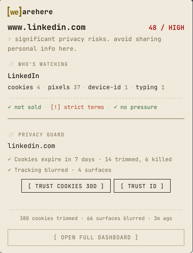

# [we]arehere

  
  

> Privacy that acts back.

Every site you open is quietly watched — by the site, and by a crowd of companies riding along behind it. Most privacy tools either hide this from you or just block a few things and call it done. wearehere does two things instead: it **shows you exactly who's watching**, and it **acts on it** — cleaning up the trails they leave and blurring the signals they use to recognise you.

It lives in your toolbar. One click shows you the page you're on. Everything happens on your machine.

  

## What it does for you

- **Tells you who's watching.** Every site gets a plain-English read and a score out of 100. You see the actual companies following you — by name — and how they're doing it: cookies, tracking pixels, click tagging, device fingerprinting.
- **Cleans up after trackers.** In the background, it shortens the cookies sites leave behind and clears third-party tracker cookies, so the company that tagged you today can't quietly recognise you tomorrow.
- **Blurs your device fingerprint.** Trackers can identify your browser from tiny technical details even with cookies cleared. wearehere feeds them slightly-wrong, per-site answers, so the same fingerprint can't be used to join you up across the web.
- **Reads the fine print.** It scans a site's terms and privacy policy and flags the hostile parts — forced arbitration, data selling, "we can change this anytime" — so you don't have to.
- **Remembers nothing about you, anywhere but your own browser.** No account, no sign-up, no cloud.

## An honest take on what we can — and can't — do

We'd rather you trust us because we're straight with you.

- **We make you harder to recognise, not invisible.** That's the honest goal. Against the everyday tracking industry — the companies that fingerprint millions of browsers and quietly stitch the profiles together — blurring reliably breaks the link. We estimate it defeats the large majority of that commodity tracking.
- **We can't beat everything.** Browsers built around privacy at a deeper level (Brave, the Tor Browser) and bank-grade fraud/anti-bot systems can still tell what's going on, because they operate below where a browser extension can reach. We're honest about that ceiling rather than pretending it isn't there.
- **A few sites break under blurring.** It's rare, but some sites (often ones behind aggressive bot-detection) misbehave when their fingerprint signals are altered. When that happens, wearehere notices you struggling and offers a one-click "trust this site" that turns blurring off just for that site.
- **Cookie cleanup catches the well-known trackers, not every disguise.** Trackers that hide behind random or first-party names can slip the net. We catch the long, well-documented tail — not adversarial naming.
- **We don't block ads or requests.** That's a different job, and [uBlock Origin](https://github.com/gorhill/uBlock) already does it superbly. wearehere is built to sit *alongside* a blocker, not replace one — it names and acts on the tracking that gets through, and shows you what's really happening.

## Your privacy, concretely

- **No accounts.** Nothing to sign up for.
- **No cloud.** Nothing you do leaves your browser. Ever.
- **No AI calls.** Nothing is sent anywhere to be analysed.
- **No telemetry.** We don't even know you installed it.

Delete the extension and every trace goes with it.

## Install

### Chrome
1. Download this repo (Code → Download ZIP) and unzip it.
2. Open `chrome://extensions` and turn on **Developer mode** (top right).
3. Click **Load unpacked** and pick the `chrome-extension` folder.
4. Click the wearehere icon in your toolbar. That's it.

### Firefox
1. Download and unzip the repo.
2. Open `about:debugging#/runtime/this-firefox`.
3. Click **Load Temporary Add-on** and pick any file in the `firefox-extension` folder.
4. Click the wearehere icon. That's it.

## License

Open source, Apache-2.0. Detection builds on a handful of well-known privacy projects — full credit in [NOTICE](./NOTICE).

Issues and feedback: [github.com/hamr0/wearehere/issues](https://github.com/hamr0/wearehere/issues).
